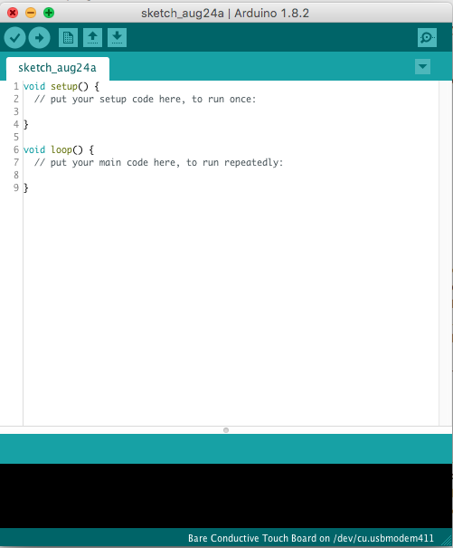
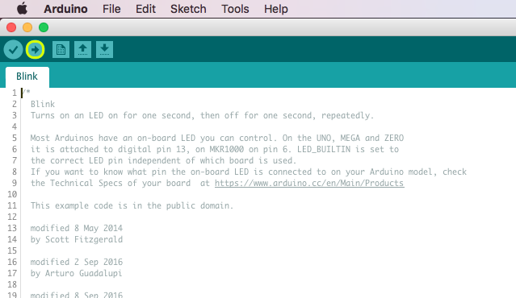

# Arduino Practise

In this section we are going to see the Arduino equivalent of the scripts we ran from the Raspberry Pi.

1. [Blink](#blink)
2. [LED PWM](#led-pwm)
3. [Button](#button)
4. [Combining everything](#combining-everything)

### Blink

We are going to run the "blink" sketch we have seen early on in this tutorial. It is the most basic sketch a sort of "Hello World!" for Arduino. It makes the built-in LED on pin 13 blink in intervals of 1 second.

1. Connect the Arduino to your laptop with the USB cable

2. Open the IDE


3. Click **Tools->Serial Port** and select the USB serial port to which your Arduino is connected to (the path changes with operating system and USB port you are using, so the name might be different for you).


4. Then, select the right board: click **Tools->Board->Arduino Uno**.


5. Then you can open the basic sketch "Blink" by clicking on **File->Example->01. Basics-> Blink**.


6. You can then upload the sketch on the Arduino by clicking the "Upload" button (the one with an arrow).


7. Once uploaded you will see the LED on pin 13 blink.


##### Alternative Hardware
You might want to try to use an external LED. Here's the wiring diagram:


##### Understanding the "Blink" code
```
void setup() {
  pinMode(LED_BUILTIN, OUTPUT);
}

void loop() {
  digitalWrite(LED_BUILTIN, HIGH);   
  delay(1000);                       
  digitalWrite(LED_BUILTIN, LOW);    
  delay(1000);                       
}
```
+ `pinMode(LED_BUILTIN, OUTPUT);` here we are initialising pin 13 as a output pin, note that instead of using a pin number we are using the LED_BUILTIN constant that stands for "pin 13"
+ `digitalWrite(LED_BUILTIN, HIGH);` here we are turning the LED on by setting the digital output as HIGH (HIGH is maximum voltage level, 5V)
+ `delay(1000);` here we are waiting for a second, note that the delay() function takes as a parameter milliseconds
+ `digitalWrite(LED_BUILTIN, LOW);` here we are turning the LED off by making the voltage LOW (0V)
+ `delay(1000);` here we are waiting for a second again

We have setup general instructions in our setup, those instructions won't change when our sketch is running.
We have inserted all the functions in the main loop so that they can be repeated infinitely.

Try to tweak the delays to see how the timing differs.

### Led PWM
Here we will see how to do pulse-width modulation with the Arduino using a LED.

##### Hardware


##### Code
For the code you can upload the built-in example "Fade" from **File->Example->01. Basics-> Fade**.


##### Understanding the "Fade" code
```
int led = 9;           
int brightness = 0;    
int fadeAmount = 5;    

void setup() {
  pinMode(led, OUTPUT);
}

void loop() {

  analogWrite(led, brightness);
  brightness = brightness + fadeAmount;

  if (brightness <= 0 || brightness >= 255) {
    fadeAmount = -fadeAmount;
  }

  delay(30);
}
```
* `int led = 9;` here we are creating a variable of type int with name "led" and storing in it the pin number that our led is connected to, note that we are using pin number 9 which is one of the PWM-capable pins (marked by the ~ sign).
* `int brightness = 0;` here we are creating a variable of type int with name "brightness" and assigning the initial value of 0
* `int fadeAmount = 5;` here we are storing the amount we want the LED to fade for each interval in the "fadeAmount" variable
* `pinMode(led, OUTPUT);` here we are declaring the led pin as an output note that this would be equivalent to this `pinMode(9, OUTPUT);`
* `analogWrite(led, brightness);` here we are writing on pin 9 ("led") the brightness values
* `brightness = brightness + fadeAmount;` here we are adding a fadeAmount to the brightness level
* `if (brightness <= 0 || brightness >= 255) {
    fadeAmount = -fadeAmount;
  }` checks that the brightness level never takes invalid values (below 0 or above 255)
* `delay(30);` a short delay to make the dimming effect more visible

### Button
Here we are going to see how Arduino receives signals from input devices using a button.

##### Hardware


##### Code
For the code you can copy and paste the following code:
```
int pushButton = 2;

void setup() {
  Serial.begin(9600);
  pinMode(pushButton, INPUT);
}


void loop() {
  int buttonState = digitalRead(pushButton);
  Serial.println(buttonState);
  delay(1);        
}
```
* `Serial.begin(9600);` here we are opening the [serial communication](https://www.arduino.cc/en/Reference/Serial) with a baud rate of 9600 Bauds
* `pinMode(pushButton, INPUT);` here we are setting the button's pin as input
* `int buttonState = digitalRead(pushButton);` here we are reading the voltage of the button and memorising it in the variable buttonState
* `Serial.println(buttonState);` here we are printing the values in the Serial Monitor
* `delay(1);` a short delay to stabilise the readings

To monitor what your Arduino is printing open the serial monitor by clicking on the serial monitor button:


### Combining everything
As with the Raspberry Pi we challenge you to combine all three previous sketches to create one that with the press of the button controls 2 LEDs.

[Here](https://www.arduino.cc/en/tutorial/pushbutton) you can find further help.

##### Acknowledgement
<small>Some material was taken from Arduino's [website](https://www.arduino.cc/)</small>
