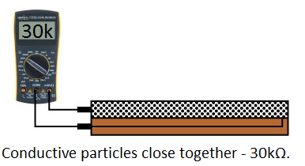
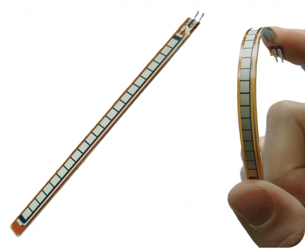
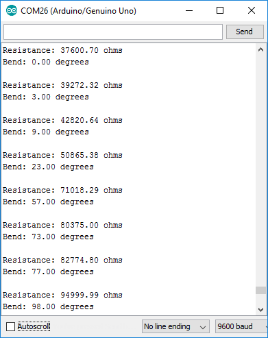
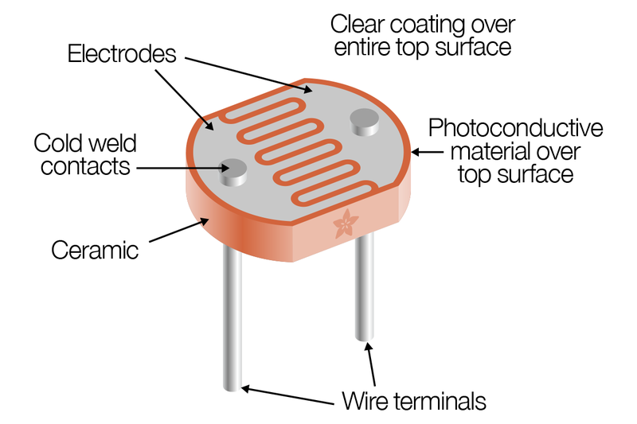
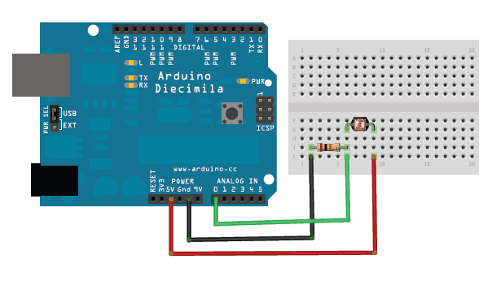

# Sensors

In this section we are going to see how  to receive data from different sensors on the Arduino. The sensors we are going to use are:

1. [Flex Sensor](#flex-sensor)
2. [Light Sensor](#light-sensor)

At the beginning of this session you should have collected a kit that is made of:
* Resistors
* 1 SoftPot Flex Sensor
* 1 Photo-resistor
[//]: # (TODO: review materials list, especially resistors)
[//]: # (TODO: add photo)


### Flex Sensor

##### How it Works

One side of the sensor is printed with a polymer ink that has conductive particles embedded in it. When the sensor is straight, the particles give the ink a resistance of about 30k Ohms. When the sensor is bent away from the ink, the conductive particles move further apart, increasing this resistance (to about 50k-70K Ohms when the sensor is bent to 90°, as in the diagram below).

  

<small>Sensor bent</small>

When the sensor straightens out again, the resistance returns to the original value. By measuring the resistance, you can determine how much the sensor is being bent.

  
<small>Sensor straight</small>

The flex sensor is designed to be flexed in just one direction – away from the ink – as demonstrated in the image below.



<small>Flex sensor bend direction (from SpectraSymbol Datasheet).</small>
Bending the sensor in the other direction will not produce any reliable data, and may damage the sensor. Also take care not to bend the sensor close to the base, as they have a tendency to kink and fail.

##### Example Circuit
The simplest way to incorporate this sensor into your project is by using it in a voltage divider. This circuit requires one resistor. Many values from 10KΩ to 100KΩ will work. If you have a resistor kit, you may want to introduce some trial-and-error to hone in on that perfect static resistance.

A value between the minimum and maximum resistance values is usually a good choice. We’ll use a 47kΩ resistor in this example. Here’s the hookup:


<small>Example circuit fritzing diagram</small>

##### Code
1. You can copy and paste this code in your Arduino IDE.  

```
/******************************************************************************
Flex_Sensor_Example.ino
Example sketch for SparkFun's flex sensors
  (https://www.sparkfun.com/products/10264)
Jim Lindblom @ SparkFun Electronics
April 28, 2016

Create a voltage divider circuit combining a flex sensor with a 47k resistor.
- The resistor should connect from A0 to GND.
- The flex sensor should connect from A0 to 3.3V
As the resistance of the flex sensor increases (meaning it's being bent), the
voltage at A0 should decrease.

Development environment specifics:
Arduino 1.6.7
******************************************************************************/
const int FLEX_PIN = A0; // Pin connected to voltage divider output

// Measure the voltage at 5V and the actual resistance of your
// 47k resistor, and enter them below:
const float VCC = 4.98; // Measured voltage of Ardunio 5V line
const float R_DIV = 47500.0; // Measured resistance of 3.3k resistor

// Upload the code, then try to adjust these values to more
// accurately calculate bend degree.
const float STRAIGHT_RESISTANCE = 37300.0; // resistance when straight
const float BEND_RESISTANCE = 90000.0; // resistance at 90 deg

void setup()
{
  Serial.begin(9600);
  pinMode(FLEX_PIN, INPUT);
}

void loop()
{
  // Read the ADC, and calculate voltage and resistance from it
  int flexADC = analogRead(FLEX_PIN);
  float flexV = flexADC * VCC / 1023.0;
  float flexR = R_DIV * (VCC / flexV - 1.0);
  Serial.println("Resistance: " + String(flexR) + " ohms");

  // Use the calculated resistance to estimate the sensor's
  // bend angle:
  float angle = map(flexR, STRAIGHT_RESISTANCE, BEND_RESISTANCE,
                   0, 90.0);
  Serial.println("Bend: " + String(angle) + " degrees");
  Serial.println();

  delay(500);
}

```
2. Upload it on your Arduino.

3. Open the Serial Monitor by clicking on this button:


4. Set the monitor's baud rate to 9600 bps from the dropdown on the bottom right corner of the window
**Note:** Always check that the monitor's baud rate corresponds to the one you set by code, otherwise you will see only random ASCII characters.


5. Now, if you bend the flex sensor, you should see resistance and estimated angle calculations change:


If the value’s don’t seem correct, make sure the constants VCC and, more importantly, R_DIV are accurate. If you used something other than a 47kΩ resistor, enter that value in for R_DIV.

Through trial-and-error, try to hone in on more accurate values for STRAIGHT_RESISTANCE and BEND_RESISTANCE – your flex sensor’s resistance when it’s straight and bent at 90°.

<small>Based on [Sparkfun's hook up guide](https://learn.sparkfun.com/tutorials/flex-sensor-hookup-guide)</small>

### Light Sensor
For the light sensing are going to use a photo-resistor or Cadmium-sulfide cell. CdS cells are little light sensors. As the squiggly face is exposed to more light, the resistance goes down. When its light, the resistance is about 5-10KΩ, when dark it goes up to 200KΩ.

They are very low cost, easy to get in many sizes and specifications, but are very inaccurate. Each photocell sensor will act a little differently than the other, even if they are from the same batch. The variations can be really large, 50% or higher! For this reason, they shouldn't be used to try to determine precise light levels in lux or millicandela. Instead, you can expect to only be able to determine basic light changes.

For most light-sentsitive applications like "is it light or dark out", "is there something in front of the sensor (that would block light)", "is there something interrupting a laser beam" (break-beam sensors), or "which of multiple sensors has the most light hitting it", photocells can be a good choice!



##### Example Circuit
To use, connect one side of the photo cell (either one, its symmetric) to power (for example 5V) and the other side to your microcontroller's analog input pin. Then connect a 10K pull-down resistor from that analog pin to ground. The voltage on the pin will be 2.5V or higher when its light out and near ground when its dark.



##### Code
In the Arduino IDE you will find under *File->Examples->10.StarterKit_BasicKit->p04ColorMixingLamp* an example sketch that uses three photo-resistors to control three LEDs to create a colour-changing lamp. We invite you to tweak the code to fit your needs and to read the value from one photo-resistor.

Color Mixing Lamp Code
```
/*
  Arduino Starter Kit example
 Project 4  - Color Mixing Lamp

 This sketch is written to accompany Project 3 in the
 Arduino Starter Kit

 Parts required:
 1 RGB LED
 three 10 kilohm resistors
 3 220 ohm resistors
 3 photoresistors
 red green and blue colored gels

 Created 13 September 2012
 Modified 14 November 2012
 by Scott Fitzgerald
 Thanks to Federico Vanzati for improvements

 http://www.arduino.cc/starterKit

 This example code is part of the public domain
 */

const int greenLEDPin = 9;    // LED connected to digital pin 9
const int redLEDPin = 10;     // LED connected to digital pin 10
const int blueLEDPin = 11;    // LED connected to digital pin 11

const int redSensorPin = A0;  // pin with the photoresistor with the red gel
const int greenSensorPin = A1;   // pin with the photoresistor with the green gel
const int blueSensorPin = A2;   // pin with the photoresistor with the blue gel

int redValue = 0; // value to write to the red LED
int greenValue = 0; // value to write to the green LED
int blueValue = 0; // value to write to the blue LED

int redSensorValue = 0; // variable to hold the value from the red sensor
int greenSensorValue = 0; // variable to hold the value from the green sensor
int blueSensorValue = 0; // variable to hold the value from the blue sensor

void setup() {
  // initialize serial communications at 9600 bps:
  Serial.begin(9600);

  // set the digital pins as outputs
  pinMode(greenLEDPin, OUTPUT);
  pinMode(redLEDPin, OUTPUT);
  pinMode(blueLEDPin, OUTPUT);
}

void loop() {
  // Read the sensors first:

  // read the value from the red-filtered photoresistor:
  redSensorValue = analogRead(redSensorPin);
  // give the ADC a moment to settle
  delay(5);
  // read the value from the green-filtered photoresistor:
  greenSensorValue = analogRead(greenSensorPin);
  // give the ADC a moment to settle
  delay(5);
  // read the value from the blue-filtered photoresistor:
  blueSensorValue = analogRead(blueSensorPin);

  // print out the values to the serial monitor
  Serial.print("raw sensor Values \t red: ");
  Serial.print(redSensorValue);
  Serial.print("\t green: ");
  Serial.print(greenSensorValue);
  Serial.print("\t Blue: ");
  Serial.println(blueSensorValue);

  /*
  In order to use the values from the sensor for the LED,
  you need to do some math. The ADC provides a 10-bit number,
  but analogWrite() uses 8 bits. You'll want to divide your
  sensor readings by 4 to keep them in range of the output.
  */
  redValue = redSensorValue / 4;
  greenValue = greenSensorValue / 4;
  blueValue = blueSensorValue / 4;

  //  print out the mapped values
  Serial.print("Mapped sensor Values \t red: ");
  Serial.print(redValue);
  Serial.print("\t green: ");
  Serial.print(greenValue);
  Serial.print("\t Blue: ");
  Serial.println(blueValue);

  /*
  Now that you have a usable value, it's time to PWM the LED.
  */
  analogWrite(redLEDPin, redValue);
  analogWrite(greenLEDPin, greenValue);
  analogWrite(blueLEDPin, blueValue);
}
```

<small>Based on [this](https://learn.adafruit.com/photocells/using-a-photocell) Adafruit guide and Adafruit's [Photocell's page](https://www.adafruit.com/product/161).</small>
