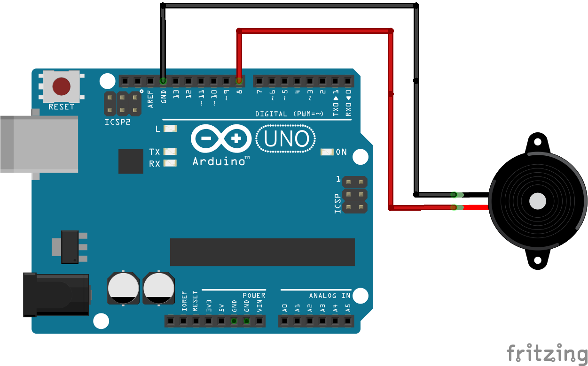
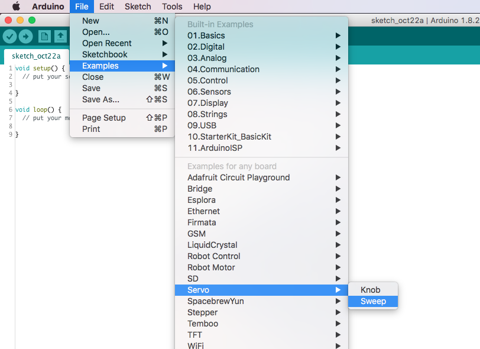
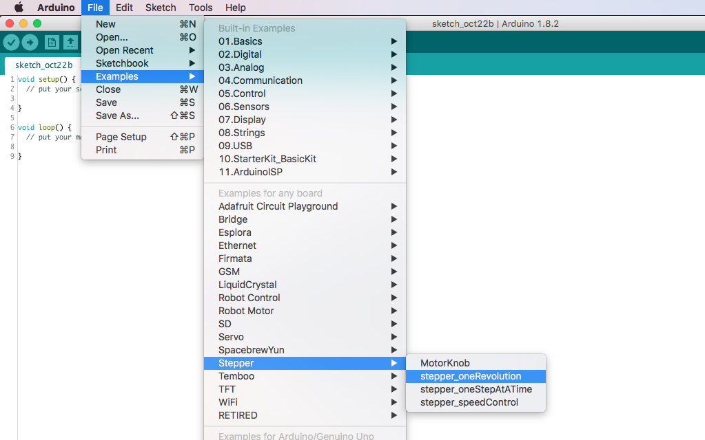

# Actuators

In this section we are going to learn about actuators and how to control them .

1. [Piezo Buzzer](#Piezo-Buzzer)
2. [Servo Motor](#servo-motor)
3. [About the Adafruit TB6612 Driver](#about-the-adafruit-tb6612-driver)
4. [DC Motor](#dc-motor)
5. [Stepper Motor](#stepper-motor)


At the beginning of this session you should have collected a kit that is made of:
* [Buzzer](http://uk.rs-online.com/web/p/piezo-buzzer-components/0457011/)
* [Servo Motor](https://www.rapidonline.com/feetech-fs90-mini-servo-120-9g-37-1339)
* [Adafruit TB6612 Driver](https://learn.adafruit.com/adafruit-tb6612-h-bridge-dc-stepper-motor-driver-breakout/overview)
* [DC Motor](https://www.adafruit.com/product/711)
* [Stepper Motor](https://www.adafruit.com/product/324)

### Piezo Buzzer
A [piezoelectric speaker](https://www.wikiwand.com/en/Piezoelectric_speaker) (sometimes colloquially called a "piezo") or buzzer is a loudspeaker that uses the piezoelectric effect for generating sound. The initial mechanical motion is created by applying a voltage to a piezoelectric material, and this motion is typically converted into audible sound using diaphragms and resonators.

<small>When fixed to a metallic diaphragm and excited with an alternating voltage, the diameter of the disc varies by a small amount, this causes dishing of the diaphragm which gives a much louder sound.</small>

##### Example Circuit
From the kit you are going to need:
* Buzzer
* Jumper Wires
* Arduino



##### Code
For the code you can use the **Example->2.Digital->toneMelody**. Feel free to play around with it.

Pi Route: You can also try to control this buzzer from your Raspberry Pi [here](http://gpiozero.readthedocs.io/en/stable/api_output.html?highlight=servo#buzzer) you can find the GPIOzero API Reference.

### Servo Motor
A [servo motor](https://www.wikiwand.com/en/Servomotor#/RC_servos) is a rotary actuator or linear actuator that allows for precise control of angular or linear position, velocity and acceleration. It consists of a suitable motor coupled to a sensor for position feedback. It also requires a relatively sophisticated controller, often a dedicated module designed specifically for use with servomotors.

##### Example Circuit
From the kit you are going to need:
* Servo Motor
* Jumper Wires
* Arduino


##### Code
For this example you are going to use the built-in [servo library](https://www.arduino.cc/en/Reference/Servo) by Arduino and we are going to use the built-in sketch **Example->Servo->Sweep**


```
/* Sweep
 by BARRAGAN <http://barraganstudio.com>
 This example code is in the public domain.

 modified 8 Nov 2013
 by Scott Fitzgerald
 http://www.arduino.cc/en/Tutorial/Sweep
*/

#include <Servo.h>

Servo myservo;  // create servo object to control a servo
// twelve servo objects can be created on most boards

int pos = 0;    // variable to store the servo position

void setup() {
  myservo.attach(9);  // attaches the servo on pin 9 to the servo object
}

void loop() {
  for (pos = 0; pos <= 180; pos += 1) { // goes from 0 degrees to 180 degrees
    // in steps of 1 degree
    myservo.write(pos);              // tell servo to go to position in variable 'pos'
    delay(15);                       // waits 15ms for the servo to reach the position
  }
  for (pos = 180; pos >= 0; pos -= 1) { // goes from 180 degrees to 0 degrees
    myservo.write(pos);              // tell servo to go to position in variable 'pos'
    delay(15);                       // waits 15ms for the servo to reach the position
  }
}

```

Pi Route: You can also try to control this servo motor from your Raspberry Pi [here](http://gpiozero.readthedocs.io/en/stable/api_output.html?highlight=servo) you can find the GPIOzero API Reference.

### About the Adafruit TB6612 Driver
A motor driver is a little current amplifier; the function of motor drivers is to take a low-current control signal and then turn it into a higher-current signal that can drive a motor.

The [Adafruit TB6612 Driver](https://learn.adafruit.com/adafruit-tb6612-h-bridge-dc-stepper-motor-driver-breakout/pinouts) contains two full H-bridges (four half H-bridges). That means you can drive four solenoids, two DC motors bi-directionally, or one stepper motor. Just make sure they're good for 1.2 Amp or less of current, since that's the limit of this chip.
It comes with built in kick-back diodes internally so you don't have to worry about the inductive kick damaging your project or driver.

There's two digital inputs per H-bridge (one for each half of the bridge) as well as a PWM input per driver so you can control motor speed. Runs at 2.7V-5V logic. The motor voltage is separate from the logic voltage. Good for motor voltages from 4.5V up to 13.5V! This wont work well for 3V motors.

##### Pinouts

**Power Pins**
* Vmotor - This is the voltage for the motors, not for the logic level. Keep this voltage between 4.5V and 13.5V. This power supply will get noisy so if you have a system with analog readings or RF other noise-sensitive parts, you may need to keep the power supplies separate (or filtered!)
* Vcc - this is the voltage for the logic levels. Set to the voltage logic you'll be using on your micro-controller. E.g. for Arduinos, 5V is probably what you want. Can be 2.7V to 5.5V so good for 3V or 5V logic
* GND - This is the shared logic and motor ground. All grounds are connected

**Signal in Pins**
These are all 'Vcc logic level' inputs
* INA1, INA2 - these are the two inputs to the Motor A H-bridges
* PWMA - this is the PWM input for the Motor A H-bridges, if you dont need PWM control, connect this to logic high.
* INB1, INB2 - these are the two inputs to the Motor B H-bridges
* PWMB - this is the PWM input for the Motor B H-bridges, if you dont need PWM control, connect this to logic high.
* STBY - this is the standby pin for quickly disabling both motors, pulled up to Vcc thru a 10K resistor. Connect to ground to disable.

**Motor Out Pins**
These are 'Vmotor level' power outputs
* Motor A - these are the two outputs for motor A, controlled by INA1, INA2 and PWMA
* Motor B - these are the two outputs for motor B, controlled by INB1, INB2 and PWMB

### Dc Motor
A [DC motor](https://www.wikiwand.com/en/DC_motor) is any of a class of rotary electrical machines that converts direct current electrical energy into mechanical energy. The most common types rely on the forces produced by magnetic fields. Nearly all types of DC motors have some internal mechanism, either electromechanical or electronic, to periodically change the direction of current flow in part of the motor.

##### Example Circuit
* Stepper Motor
* Adafruit TB6612 Driver
* Jumper Wires
* Arduino


##### Code
For this sketch copy and paste the following code:
```
/*
+ ain1 to pin 8
+ ain2 to pin 9
+ motorA to DC motor
+ pwma to 5V
*/

int ain1 = 8;
int ain2 = 9;

void setup(){
  pinMode(ain1,OUTPUT);  //Logic pins are also set as output
  pinMode(ain2,OUTPUT);
  Serial.begin(9600);
}

void loop(){

  /*CLOCKWISE MOTION:
     + ain1 = HIGH
     + ain2 = LOW
  */
  digitalWrite(ain1,HIGH);
  digitalWrite(ain2,LOW);

  Serial.println("Clockwise");

  //Clockwise for 3 secs
  delay(3000);     

  /*STOPPING:
     + ain1 = HIGH
     + ain2 = LOW
  */
  digitalWrite(ain1,HIGH);
  digitalWrite(ain2,HIGH);

  Serial.println("Braking");

  delay(1000);

  /*STOPPING:
     + ain1 = LOW
     + ain2 = HIGH
  */
  digitalWrite(ain1,LOW);
  digitalWrite(ain2,HIGH);

  Serial.println("Anti-Clockwise");

  delay(3000);

  //TO PAUSE THE MOTOR
  digitalWrite(ain1,HIGH);
  digitalWrite(ain2,HIGH);

  Serial.println("On Pause");

  delay(1000);
 }
```

### Stepper Motor
A [stepper motor](https://www.wikiwand.com/en/Stepper_motor) or step motor or stepping motor is a brushless DC electric motor that divides a full rotation into a number of equal steps. The motor's position can then be commanded to move and hold at one of these steps without any position sensor for feedback (an open-loop controller), as long as the motor is carefully sized to the application in respect to torque and speed.

##### Example Circuit
From the kit you are going to need:
* Stepper Motor
* Adafruit TB6612 Driver
* Crocodile Clips
* Jumper Wires
* Arduino


##### Code
For this example you are going to use the built-in [stepper library](https://www.arduino.cc/en/Reference/Stepper) by Arduino and we are going to use the built-in sketch **Example->Stepper->stepper_oneRevolution**



```
/*
 Stepper Motor Control - one revolution

 This program drives a unipolar or bipolar stepper motor.
 The motor is attached to digital pins 8 - 11 of the Arduino.

 The motor should revolve one revolution in one direction, then
 one revolution in the other direction.


 Created 11 Mar. 2007
 Modified 30 Nov. 2009
 by Tom Igoe

 */

#include <Stepper.h>

const int stepsPerRevolution = 200;  // change this to fit the number of steps per revolution
// for your motor

// initialize the stepper library on pins 8 through 11:
Stepper myStepper(stepsPerRevolution, 8, 9, 10, 11);

void setup() {
  // set the speed at 60 rpm:
  myStepper.setSpeed(60);
  // initialize the serial port:
  Serial.begin(9600);
}

void loop() {
  // step one revolution  in one direction:
  Serial.println("clockwise");
  myStepper.step(stepsPerRevolution);
  delay(500);

  // step one revolution in the other direction:
  Serial.println("counterclockwise");
  myStepper.step(-stepsPerRevolution);
  delay(500);
}

```

### Acknowledgement
[Adafruit Learn](https://learn.adafruit.com/)
[Wikiwand Piezoelectric Speaker](https://www.wikiwand.com/en/Piezoelectric_speaker)

